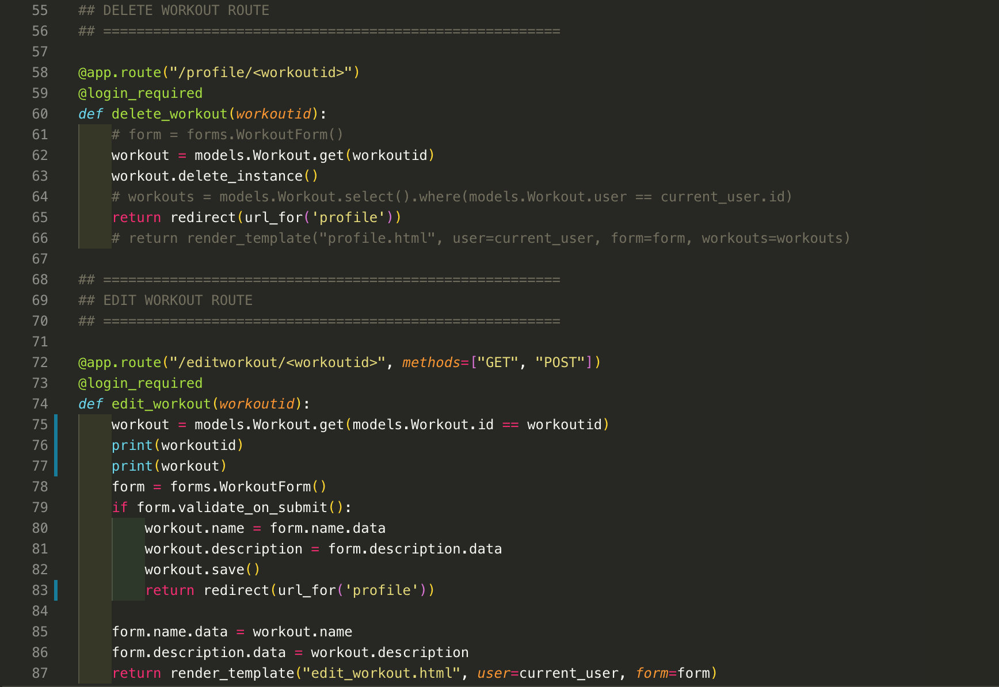
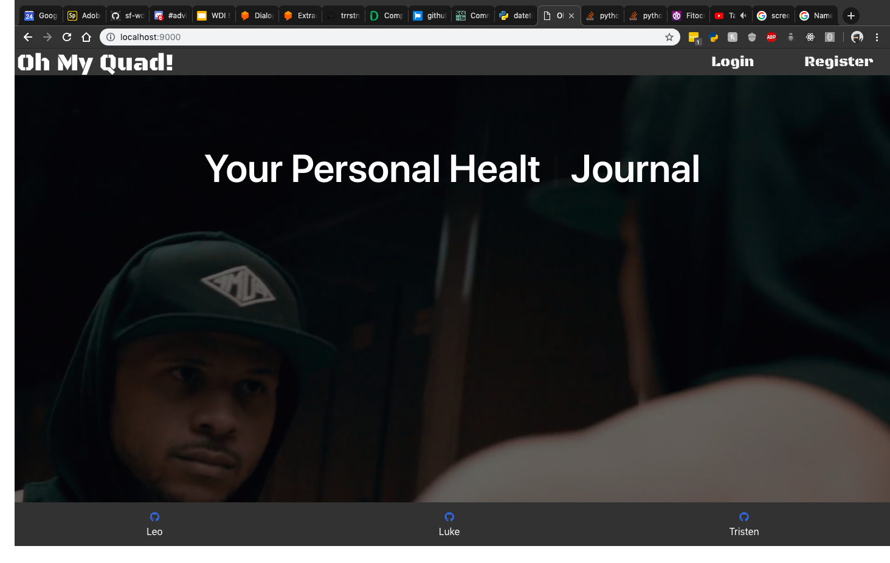
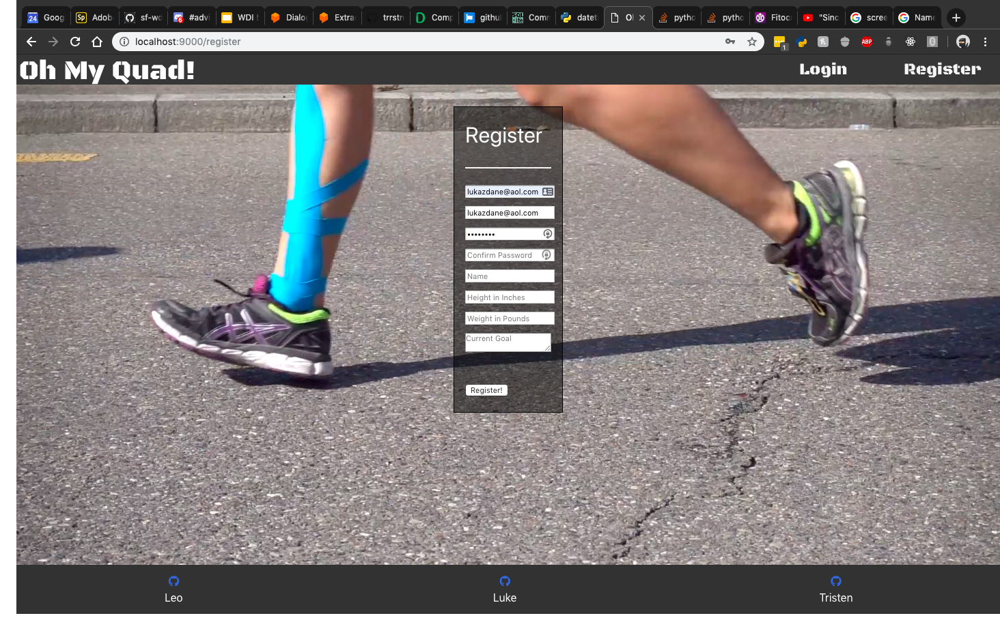
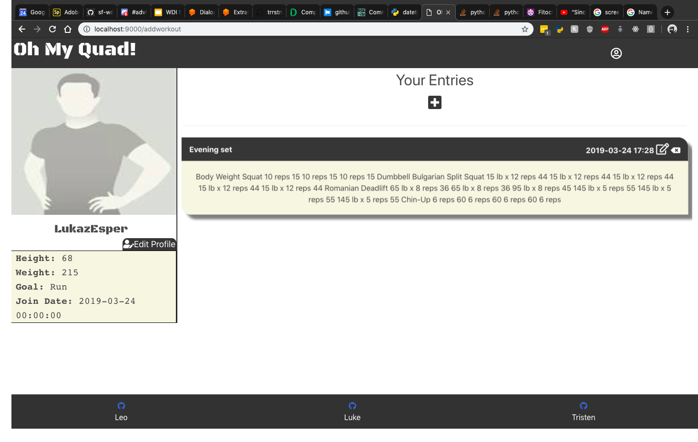
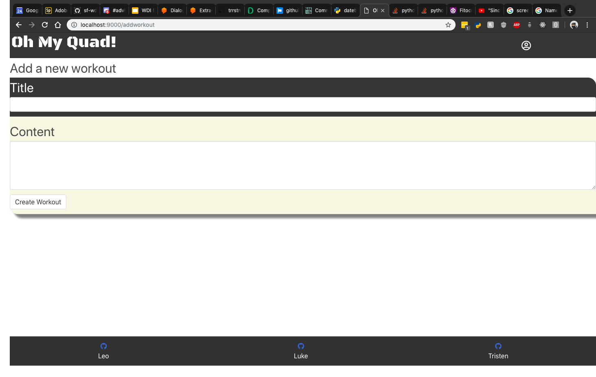
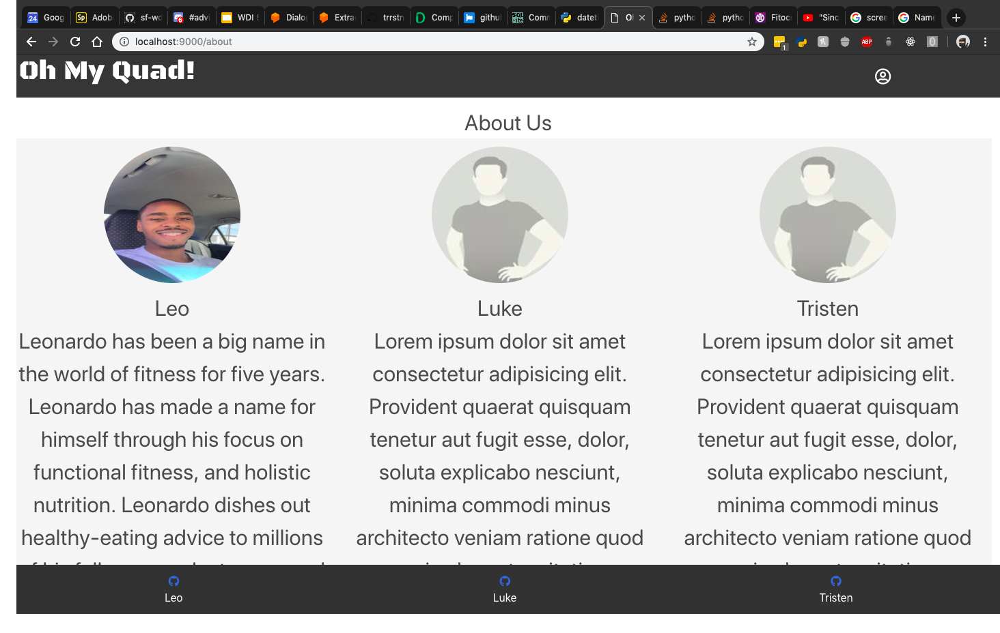
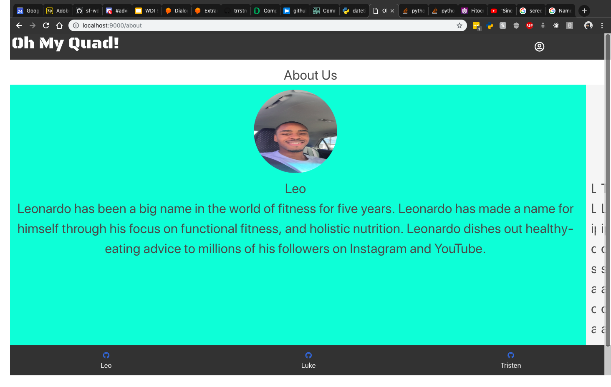
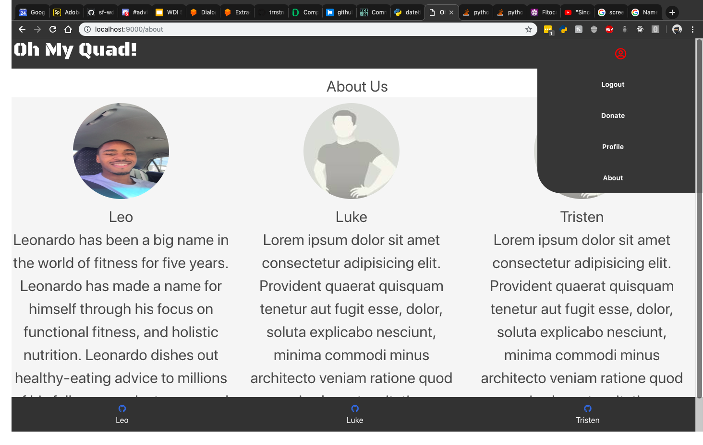

# Project-3-OhMyQuad

- Fitness Journal

### Leo

#### Contributions

- Created User authentication
- 

- Created delete and update functionality for the Workout model and the ability for the user to update certain profile information

#### Challenges

- Delete and update CRUD functionality
- Understanding which queries to write to our database so that the correct information was retrieved

#### Shout out

- team

#### Moving Forward

- Dive a little more into designing the site with css

### Luke

#### Contributions

- Styling, Templates, support
- insert code screenshot here
- describ code i'm proud of

#### Challenges

- Styling kept reverting to previous verions
- github conflicts abound
- sqlite commands

#### Shout out

- Leo(for handling auth and fixing crud)
- Isha(For dealing with my teams near constant questions)

#### Moving Forward

- Add image upload, re-add broken exercise button, restyle profile page(and its add/edit extensions), edit all forms and models to include the exercise(choices)

### Tristan

#### Contributions

- [what you did]
- [insert code screenshot here]
- [describe the code snippet you chose]

#### Challenges

- [challange 1]
- [challange 2]

#### Shout out

- []

#### Moving Forward

- []

#### Landing

#### Login/Register

### Profile

### About

